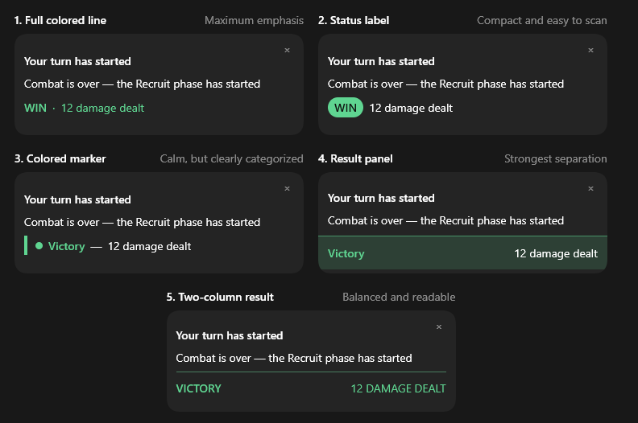
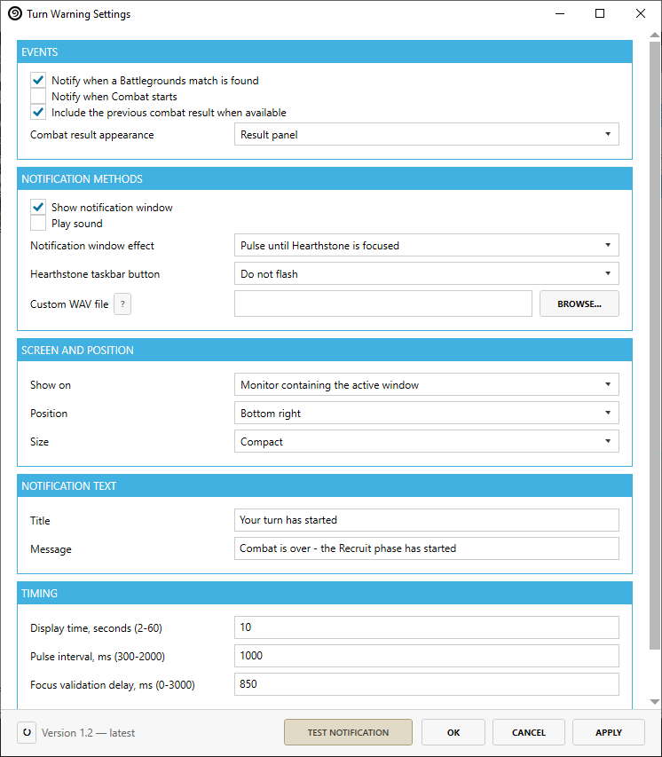

# TurnWarning

Never miss the start of a Battlegrounds match or Recruit phase while Hearthstone is minimized or behind another window.

TurnWarning is a plugin for [Hearthstone Deck Tracker](https://github.com/HearthSim/Hearthstone-Deck-Tracker) that displays a configurable notification when a Battlegrounds match is found or your next Recruit phase begins while Hearthstone is not focused. It is intended for the Windows desktop version of HDT.





## Features

- Notifies you when a Battlegrounds match reaches hero selection while Hearthstone is unfocused.
- Notifies you when the first Recruit phase begins after hero selection.
- Notifies you when a new Recruit phase starts after Combat.
- Optionally alerts you when a Battlegrounds Combat phase begins.
- Avoids warnings caused only by minimizing Hearthstone during an already active Recruit phase.
- Optionally shows the previous combat result and hero damage.
- Colors wins green, losses red, and ties yellow.
- Includes five combat-result layouts and standard or compact notification styles.
- Supports notification pulsing, Hearthstone taskbar flashing, and custom WAV sounds.
- Supports custom notification text, display duration, screen position, and monitor selection.

## How it works

TurnWarning validates each notification against the current HDT game state and the Hearthstone window state. A Recruit-phase warning is created only from a confirmed phase transition and only when Hearthstone is minimized or unfocused at that moment. Focus and game state are checked again before the notification appears.

Pending and visible warnings are cancelled when they are no longer relevant, including when you return to Hearthstone, pass the turn, enter Combat, end the match, or switch to spectator mode. Reconnects and incomplete game-state observations are handled conservatively to reduce false positives.

## Configuration

Open the settings from `Plugins -> TurnWarning` in HDT, or use the `Settings` button in HDT's plugin list.

Available options include:

- Enable or disable the notification window, sound, and taskbar flashing independently.
- Notify when a queued Battlegrounds match reaches hero selection.
- Show the previous combat result and hero damage using one of five layouts.
- Pulse the notification three times or until Hearthstone is focused.
- Flash the Hearthstone taskbar button three times or until focused.
- Use the Windows system sound or a custom WAV file.
- Select the active-window monitor, Hearthstone monitor, primary monitor, or a specific connected monitor.
- Place the notification in any corner or the center of the selected monitor.
- Choose a standard or compact notification style.
- Customize the title and message.
- Set the display time from 2 to 60 seconds.
- Preview unsaved settings with `TEST NOTIFICATION`.

Sound is disabled by default. Custom sounds must be uncompressed PCM WAV files no larger than 5 MB or 10 seconds, with mono or stereo audio at 8-96 kHz and 8, 16, 24, or 32 bits. If the selected file is missing or invalid, TurnWarning immediately falls back to the Windows system sound and does not delay the notification.

## Installation

### From a release ZIP

1. Download `TurnWarning.zip` from the [latest release](https://github.com/numbereleven-a/HDT-TurnWarning/releases/latest).
2. Open HDT and go to `Options -> Tracker -> Plugins`.
3. Drag and drop the ZIP file onto the plugins page, or use HDT's plugin installation control if available.
4. Enable TurnWarning and restart HDT if requested.

### Manual installation

1. Close HDT.
2. Create `%AppData%\HearthstoneDeckTracker\Plugins\TurnWarning`.
3. Copy `TurnWarning.dll` into that folder.
4. Start HDT and enable TurnWarning under `Options -> Tracker -> Plugins`.

Restart HDT after replacing the DLL during an update.

## Compatibility

- Hearthstone Deck Tracker 1.53.8
- .NET Framework 4.7.2
- Windows x64
- Battlegrounds Solo and Duos

The plugin was built and verified against HDT 1.53.8.

## Limitations

- Combat results are omitted when HDT cannot determine them safely, including incomplete Combat observation and battles against an already defeated opponent.
- If the Hearthstone window cannot be identified, no warning is shown.
- If a selected monitor is disconnected, the notification falls back to the primary monitor.
- The plugin never clicks, focuses Hearthstone, simulates input, or modifies the game process.

## Build

Building requires the Windows SDK, the .NET Framework 4.7.2 targeting pack, and an installed copy of HDT. The project locates HDT under `%LocalAppData%\HearthstoneDeckTracker` by default.

```powershell
dotnet build TurnWarning\TurnWarning.csproj -c Release -p:Platform=x64
dotnet run --project TurnWarning.Tests\TurnWarning.Tests.csproj -c Release
```

## Download

[](https://github.com/numbereleven-a/HDT-TurnWarning/releases/latest)
[](https://github.com/numbereleven-a/HDT-TurnWarning/releases)

## License

TurnWarning is released under the [MIT License](LICENSE).
